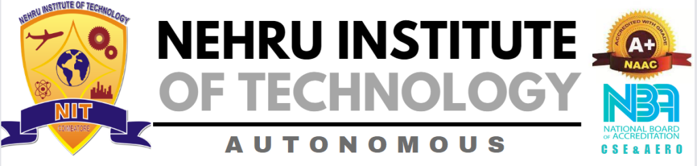

<div class="alert alert-block alert-info" style="display: flex; flex-wrap: wrap; flex-direction: columns;">
    <div style="width: 70%; padding: 10px; box-sizing: border-box;">
        <div style="display: flex;">
            <div style="flex: 1;  padding: 10px; box-sizing: border-box;">
          
        <!-- --> 
            </div>
        </div>
        <div style="display: flex;">
            <div style="flex: 1; padding: 10px; box-sizing: border-box;">
        <h4>Lecture notes on</h4>
        <h3><b><i>Python Programming</i></b></h3>
        <i>By <b>Jason Pandian</b>,</i> Assistant Professor,<br> Department of Information Technology       
            </div>
        </div>    
    </div>
    <div style="width: 30%; padding: 10px; box-sizing: border-box;">
            
          <!-- -->   
    </div>      
</div>

# Introduction to Python Programming

## What is Programming?
Programming is the process of automating tasks logically and efficiently through writing code that a computer can understand and execute.

# Hello World


```python
print("Hello World")
```

    Hello World


# Print Hello World n times 


```python
n = 10
for i in range(n):
    print("Hello World")
```

    Hello World
    Hello World
    Hello World
    Hello World
    Hello World
    Hello World
    Hello World
    Hello World
    Hello World
    Hello World


# Key Takeaway

- Programming automates tasks.
- Good programs aim for logical and efficient solutions.
- Conciseness (fewer lines of code) is a desirable aspect of effective programming.

<div class="alert alert-block alert-info">
    
<b>Any Questions?</b> 
    
</div>

# Standard Definition

Programming is the process of designing and building executable computer programs to perform specific tasks or solve particular problems. It involves creating a set of instructions that a computer can understand and execute. The primary goal of programming is to develop software that can automate tasks, process data, or provide solutions to various challenges.

## Python Programming

- Python is a high-level programming interpreted language known for its simple syntax, rich libraries, and conciseness, allowing for less code. 
- It is an object-oriented programming language that has gained notable popularity in web development, enterprise automation, and artificial intelligence. 
- Python is also recognized as a rapid prototyping language, facilitating the transition from a conceptual idea to a functional code solution.

## Python Interpreter

A Python interpreter is a program that executes Python code. It reads and interprets Python scripts or commands, converting them into machine-readable instructions that the computer's hardware can execute. ie Interpreter is responsible for executing Python code. It serves as the bridge between the written Python script and the machine, translating the code into machine-readable instructions.

### 1. Interactive Mode:
The interpreter supports an interactive mode where users can enter Python commands one at a time and receive immediate feedback. This is helpful for testing small pieces of code or exploring language features.


```python
$ python
>>> print("Hello, Python!")
Hello, Python!
```

### 2. Script Execution:
The interpreter is used to execute Python scripts stored in files. By running the interpreter followed by the script's filename, the code within the script is executed.


```python
$ python hello.py
```

### 3. Dynamic Typing:
Python is dynamically typed, meaning variable types are determined at runtime. The interpreter manages this dynamic typing, allowing flexibility in variable usage.


```python
>>> x = 5
>>> type(x)
<class 'int'>
```


```python
x = 5
type(x)
```

### Garbage Collection:
The interpreter includes a garbage collector that automatically handles memory management. It identifies and frees up memory occupied by objects that are no longer in use.

### 4.Standard Library
Python comes with an extensive standard library that provides ready-to-use modules and packages for various tasks. The interpreter interacts with these libraries to extend Python's functionality


```python
# Example Code Using Python Standard Library

# Using the `datetime` module to work with dates and times
from datetime import datetime

# Get the current date and time
current_datetime = datetime.now()

# Print the current date and time
print("Current Date and Time:", current_datetime)

# Format the date as a string
formatted_date = current_datetime.strftime("%Y-%m-%d %H:%M:%S")
print("Formatted Date:", formatted_date)
```

- We import the datetime module from the standard library.
- We use datetime.now() to get the current date and time.
- We print the current date and time.
- We format the date as a string using strftime() and print the formatted date.

### 5.Extensibility 
The interpreter is extensible, allowing the incorporation of modules written in languages like C. This feature enables developers to enhance Python's capabilities or integrate it with existing systems.

### 6.Platform Independence
Python interpreters are available for various platforms (Windows, macOS, Linux), making Python code portable across different operating systems.

### 7.Error Handling
The interpreter identifies syntax errors and runtime errors, providing feedback to the developer for debugging purposes.


```python
# Basic Error Handling Example

try:
    # Attempt to perform a division by zero
    result = 10 / 0

except ZeroDivisionError as e:
    # Handle the ZeroDivisionError exception
    print("Error:", e)
    print("Cannot divide by zero. Please check your input.")
    
except Exception as e:
    # Handle any other exceptions
    print("An unexpected error occurred:", e)

finally:
    # Code in the 'finally' block will always be executed, whether an exception occurred or not
    print("Execution completed.")

# The program continues to run after handling the exception
print("Program continues...")

```

# Assignment Operator " = " 

A simple program to add two integers. and print the result.


```python
num1 = 10
num2 = 5
sum_result = num1 + num2
print("Result", sum_result)
```

# Print Triangle


```python
# Height of the triangle
height = 5

# Loop to print each row
for i in range(1, height + 1):
    # Print spaces before the stars
    print(" " * (height - i), end="")
    
    # Print stars for the current row
    print("* " * i)

```


<div class="alert alert-block alert-info">
    
# Any Questions or Doubts?

[**You can Download and Run this Jupyter Notebook from the following link:**](https://github.com/PandiaJason) 

https://github.com/PandiaJason/Python/blob/main/lectures/l1-introduction-to-python-programming.ipynb
    
</div>


```python

```
